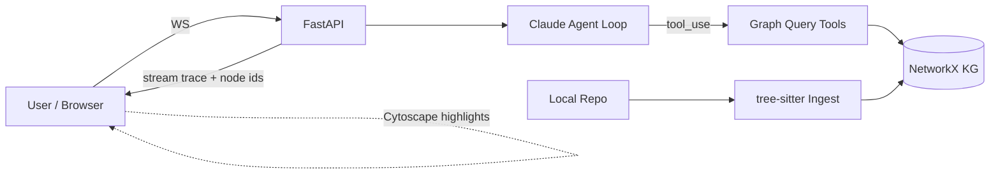
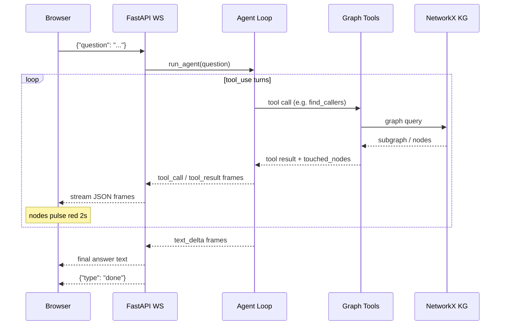

# Architecture

CodeGraph Agent ingests a local code repository, builds a structural knowledge graph of its symbols, and exposes that graph as tools to a Claude-powered agent. Users ask natural-language questions; the agent plans multi-hop graph traversals to answer them; the results stream back to a React UI that animates the touched nodes in real time.



---

## 1. Ingestion layer — `backend/src/codegraph/ingest/`

### `walker.py` — directory traversal

`ingest_repo(repo_root)` walks the repository with `pathlib.Path.rglob`, filtering for `.py`, `.ts`, and `.js` extensions. Hidden directories (names starting with `.`) and `node_modules` are skipped. For each file it calls the appropriate parser and accumulates `Symbol` objects.

### `parsers.py` — tree-sitter parsing

`parse_python(path)` and `parse_typescript(path)` each load the corresponding tree-sitter grammar, parse the file bytes, and walk the concrete syntax tree. Extracted node types:

| Source kind | Symbol kind |
|---|---|
| `module` / top-level | `File` |
| `class_definition` / `class_declaration` | `Class` |
| `function_definition` | `Function` |
| `function_declaration` / `arrow_function` (inside class) | `Method` |
| `import_statement` / `import_from_statement` | recorded as extra metadata on the File symbol |

Line spans are 1-indexed (`start_line`, `end_line`) and extracted directly from tree-sitter node positions.

### `models.py` — Symbol dataclass

```python
@dataclass
class Symbol:
    id: str          # "<kind>:<file_rel_path>:<name>"
    kind: str        # "File" | "Class" | "Function" | "Method"
    name: str
    file: str        # relative path from repo root
    start_line: int
    end_line: int
    extra: dict      # parser-specific metadata (imports, bases, calls)
```

`id` is deterministic and stable across re-ingests of the same repo, which lets the graph cache stay valid as long as the file structure doesn't change.

---

## 2. Graph layer — `backend/src/codegraph/graph/`

### `builder.py` — `build_graph(symbols, repo_root) → nx.DiGraph`

Builds a directed graph in two passes:

**Pass 1 — nodes.** Every `Symbol` becomes a node. Node attributes mirror the dataclass fields (`kind`, `name`, `file`, `start_line`, `end_line`).

**Pass 2 — edges.** Five edge kinds are resolved:

| Edge kind | Resolution strategy |
|---|---|
| `CONTAINS` | File node → every symbol defined in that file; Class node → its methods (parent pointer in `Symbol.extra`) |
| `DEFINES` | Same as `CONTAINS` but typed differently — used for module-level function/class definitions |
| `IMPORTS` | Import names extracted by the parser are matched against known symbol names; unresolved imports create stub nodes |
| `CALLS` | Call expressions found in function bodies (by tree-sitter) are matched against known symbol IDs by name |
| `INHERITS` | Base-class list from `Class.extra["bases"]` is matched against known Class nodes |

Unresolved references (imports to external packages, calls to builtins) are silently dropped — the graph contains only what the ingest layer can verify.

### `persistence.py` — JSON round-trip

`save_graph(g, path)` serialises with `nx.node_link_data(g)` and writes atomically: it writes to a `.tmp` sibling, then `os.replace`s it into place. `load_graph(path)` deserialises with `nx.node_link_graph`. This means the cache is never in a partial state even if the server crashes mid-write.

---

## 3. Tool layer — `backend/src/codegraph/tools.py`

Seven pure functions, no Anthropic dependency. Each returns a list of node-attribute dicts and sets a `touched_nodes` field the API layer reads to drive graph highlights.

| Function | Graph traversal |
|---|---|
| `find_definition(g, symbol_name, kind)` | Name-match scan over all nodes; `O(n)` |
| `find_callers(g, symbol_id)` | `g.predecessors(symbol_id)` filtered to `CALLS` edges |
| `find_callees(g, symbol_id)` | `g.successors(symbol_id)` filtered to `CALLS` edges |
| `neighborhood(g, symbol_id, depth)` | `nx.ego_graph(g, symbol_id, radius=depth, undirected=True)` |
| `shortest_path(g, source_id, target_id)` | `nx.shortest_path(g, source, target)` — directed, unweighted |
| `search_symbols(g, query, kind)` | Case-insensitive `query in name` scan; optional `kind` filter |
| `read_source(g, symbol_id, repo_root)` | `open(file).readlines()[start_line-1:end_line]`; capped at 200 lines |

---

## 4. Agent loop — `backend/src/codegraph/agent.py`

`run_agent(question, graph, repo_root)` is a **synchronous generator** that yields typed event dicts:

```python
{"type": "tool_call",   "name": ..., "args": ..., "touched_nodes": [...]}
{"type": "tool_result", "name": ..., "result": ...}
{"type": "text_delta",  "text": ...}
{"type": "done"}
```

**Loop structure:**

1. Build an initial `messages` list with the user question.
2. Call `anthropic.messages.create(model, tools=TOOL_SCHEMAS, messages=messages)` (non-streaming for simplicity).
3. Inspect `response.stop_reason`:
   - `"tool_use"` → dispatch each tool block to the matching function in `tools.py`, yield `tool_call` + `tool_result` events, append both the assistant turn and tool results to `messages`, loop.
   - `"end_turn"` → yield `text_delta` events for each text block, yield `done`, return.
4. `touched_nodes` is extracted from the tool result dict before it is serialised — tools return it as a top-level key alongside `"nodes"`.

**Why a sync generator?** The agent logic is sequential and free of I/O interleaving. A sync generator keeps the code readable and avoids async-within-async pitfalls. The FastAPI WebSocket handler bridges it to the async world via `queue.Queue` — a daemon thread runs `run_agent` and puts events into the queue; the async handler `await`s items from the queue.

---

## 5. API layer — `backend/src/codegraph/main.py`

### `POST /ingest`

1. Validates the path exists on the local filesystem.
2. Calls `ingest_repo(path)` → `build_graph(symbols, path)`.
3. Saves to `.kg_cache/<repo_slug>.json` via `persistence.save_graph`.
4. Stores the graph in `app.state.graph` and `app.state.repo_root`.
5. Returns `{nodes, edges, symbols}` counts.

### `GET /graph`

Returns `nx.node_link_data(app.state.graph)` directly — Cytoscape.js on the frontend accepts this format after a thin transform in `App.tsx`.

### `WebSocket /chat`

```
Browser opens ws://localhost:8000/chat
→ receives {"question": "..."}
→ starts daemon thread: run_agent(question, graph, repo_root)
   thread puts events into queue.Queue
→ async loop: queue.get_nowait() or asyncio.sleep(0.05)
   sends each event as JSON text frame
→ on {"type": "done"}: closes connection
```

Frame types sent to the browser:

| Frame type | Fields |
|---|---|
| `tool_call` | `name`, `args`, `touched_nodes` |
| `tool_result` | `name`, `result` |
| `text_delta` | `text` |
| `done` | — |

The server also pre-indexes `backend/sample_repo/` on startup (`@app.on_event("startup")`), so the demo works immediately without any `POST /ingest` call.

---

## 6. Frontend — `frontend/src/`

### `useChat.ts` — WebSocket lifecycle

`useReducer` manages a flat `messages: ChatMessage[]` array. Action types:

- `TOOL_CALL` — appends a tool-call message
- `TOOL_RESULT` — appends a tool-result message
- `TEXT_DELTA` — appends to the current text accumulator
- `DONE` — closes the WebSocket and marks streaming complete

The hook returns `{messages, touchedNodes, sendQuestion, isStreaming}`. `touchedNodes` is a `string[]` of node IDs from the most recent `tool_call` frame; it drives the graph highlight effect.

### `GraphPanel.tsx` — Cytoscape.js

Cytoscape is initialised imperatively via `useRef` on mount with the `cose` layout. Node colour map:

| Kind | Colour |
|---|---|
| `File` | Indigo |
| `Class` | Green |
| `Function` | Orange |
| `Method` | Yellow |

When `touchedNodes` changes (from `useChat`), the component adds the `.highlighted` CSS class to each touched node and removes it after 2 seconds via `setTimeout`. The `.highlighted` class applies a red border and a subtle background shift, creating a visible "pulse" without a full animation library.

### `ToolCallCard.tsx` — collapsible tool cards

Renders as a `<details>` / `<summary>` pair. The summary shows the tool name and argument keys; the body shows the full JSON result. Collapsed by default to keep the chat panel readable during long traversals.

---

## 7. Data flow — full request lifecycle



---

## 8. Key design decisions

### NetworkX over a dedicated graph DB

NetworkX is pure Python, ships as a pip package, and requires no server process. For single-repo scale (tens of thousands of nodes), it is more than fast enough — typical graph queries complete in milliseconds. Using a dedicated graph DB (Neo4j, Memgraph) would add infrastructure complexity with no runtime benefit at this scale. The JSON persistence format is human-readable and inspectable with any text editor.

### Sync generator bridged via `queue.Queue`

The agent loop is CPU-bound and sequential. Writing it as a sync generator keeps the code linear and easy to reason about. The bridge to FastAPI's async WebSocket handler is a standard `queue.Queue`: a daemon thread runs the generator and puts events; the async handler polls the queue with a short sleep. This avoids the complexity of `asyncio.run_coroutine_threadsafe` or converting the entire agent loop to async.

### Structural-only (no embeddings)

The absence of embeddings is a deliberate design choice, not a gap. The goal is to demonstrate that graph topology alone can answer the structural questions engineers actually ask. Adding an embedding layer would conflate two different retrieval strategies and obscure the KG-as-tool thesis. A hybrid mode (embedding fallback for semantic queries) is listed in the roadmap as a future optional layer, not a core requirement.
