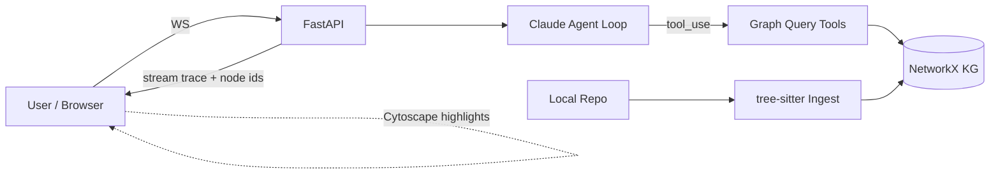

# CodeGraph Agent


> M3 graph core shipped. `build_graph()` converts `Symbol` lists into a NetworkX `DiGraph` with typed nodes (`File`, `Class`, `Function`, `Method`) and edges (`CONTAINS`, `DEFINES`, `IMPORTS`, `CALLS`, `INHERITS`). Graphs persist to/from JSON. `python -m codegraph.graph <kg.json>` inspects any saved graph. Agent loop and UI are not yet built.

---

## Problem statement

Vector-RAG treats code as prose and loses what actually matters: **structure**. A senior engineer asking *"what breaks if I change `handle_request`?"* needs call edges, inheritance chains, and import graphs — not cosine-similar docstrings.

CodeGraph Agent builds a **structural knowledge graph** of a repository's symbols and exposes that graph as tools to a Claude-powered agent. Instead of a fixed retrieval pipeline, the agent plans multi-hop traversals:

```
find_callers(handle_request)
  → neighborhood(each caller, depth=1)
  → rank by blast radius
```

The result is an answer that cites exact files and functions, with a live graph visualization showing which nodes the agent touched.

---

## What works — M3

| Area | Detail |
|---|---|
| Backend scaffold | FastAPI app (`src/codegraph/main.py`), managed with `uv` and `pyproject.toml` |
| Health endpoint | `GET /health` returns `{"status": "ok"}`; covered by a pytest smoke test |
| Frontend scaffold | Vite 6 + React 19 + TypeScript; `pnpm dev` starts the dev server on port 5173 |
| Linting / formatting | ruff-format + ruff lint on all backend Python; prettier on frontend TS/JSON/CSS |
| Pre-commit hooks | Both linters run on commit via `.pre-commit-config.yaml` |
| **Code ingestion** | `codegraph.ingest` walks a repo with `pathlib`, parses `.py` / `.ts` / `.js` files using `tree-sitter`, and emits typed `Symbol` dataclasses (`File`, `Class`, `Function`, `Method`) with file path and 1-indexed line spans |
| **Ingest CLI** | `python -m codegraph.ingest <path>` prints a JSON array of all symbols |
| **Knowledge graph** | `codegraph.graph.build_graph(symbols, repo_root)` builds a `networkx.DiGraph` with typed nodes and 5 edge kinds: `CONTAINS`, `DEFINES`, `IMPORTS` (Python, best-effort), `CALLS` (intra-file regex), `INHERITS` (Python) |
| **Graph persistence** | `save_graph(g, path)` / `load_graph(path)` round-trip via `nx.node_link_data` JSON (atomic write) |
| **KG-inspect CLI** | `python -m codegraph.graph <kg.json>` prints node/edge counts by type and samples 5 nodes + 5 edges |
| **Tests** | 21 pytest tests: 10 for M2 ingestion + 10 for M3 graph (nodes, edges, persistence round-trip, CALLS, INHERITS) + 1 health |
| License | MIT |

Agent loop and UI are not yet built.

---

## Planned architecture



**Node types:** `File`, `Module`, `Class`, `Function`, `Method`

**Edge types:** `IMPORTS`, `DEFINES`, `CALLS`, `INHERITS`, `CONTAINS`

**Agent tools (planned):** `find_definition`, `find_callers`, `find_callees`, `neighborhood`, `shortest_path`, `search_symbols`, `read_source`

---

## Quickstart

Code ingestion and graph building are functional. Agent loop and UI are not yet built.

```bash
# Backend
cd backend
uv sync
uv run uvicorn codegraph.main:app --reload
# → http://localhost:8000/health

# Frontend (separate terminal)
cd frontend
pnpm install
pnpm dev
# → http://localhost:5173
```

```bash
# Run backend tests
cd backend
uv run pytest
```

```bash
# Ingest a repo and print symbols as JSON
cd backend
uv run python -m codegraph.ingest /path/to/any/repo
```

```bash
# Build a knowledge graph and save it, then inspect it
cd backend
uv run python -c "
from codegraph.graph import build_graph, save_graph
from codegraph.ingest import ingest_repo
symbols = ingest_repo('/path/to/any/repo')
g = build_graph(symbols, '/path/to/any/repo')
save_graph(g, 'kg.json')
"
uv run python -m codegraph.graph kg.json
```

Docker Compose is a stub — Dockerfiles are not yet written:

```bash
docker compose up  # not functional yet
```

---

## Repository layout

```
codegraph-agent/
├── backend/                   # Python / FastAPI
│   ├── pyproject.toml         # uv-managed; ruff + pytest configured
│   ├── src/codegraph/
│       ├── __init__.py
│       ├── main.py            # FastAPI app + /health endpoint
│       ├── ingest/            # M2: tree-sitter ingestion
│       │   ├── __init__.py    # exports ingest_repo()
│       │   ├── __main__.py    # CLI: python -m codegraph.ingest <path>
│       │   ├── models.py      # Symbol dataclass
│       │   ├── parsers.py     # parse_python(), parse_typescript()
│       │   └── walker.py      # ingest_repo() directory walker
│       └── graph/             # M3: knowledge graph
│           ├── __init__.py    # exports build_graph, save_graph, load_graph
│           ├── __main__.py    # CLI: python -m codegraph.graph <kg.json>
│           ├── builder.py     # build_graph() — nodes + 5 edge kinds
│           └── persistence.py # save_graph() / load_graph() JSON round-trip
│   └── tests/
│       ├── test_health.py
│       ├── test_ingest.py     # 10 tests for M2
│       ├── test_graph.py      # 10 tests for M3
│       └── fixtures/
│           └── sample_repo/   # sample.py + utils.ts + .hidden/
├── frontend/                  # Vite + React + TypeScript
│   ├── package.json
│   ├── vite.config.ts
│   ├── tsconfig.json
│   └── src/
│       ├── main.tsx
│       └── App.tsx
├── docker-compose.yml         # stub
├── .pre-commit-config.yaml
├── .gitignore
└── README.md
```

---

## Why this is portfolio-strong

- **KG-as-tool** is a rare, senior-signal pattern — most people default to vector RAG
- Live graph animation makes results screenshot-able and GIF-able
- Every layer (parser → graph → tool → agent loop → streaming UI) is a distinct engineering artifact reviewers can inspect
- Runs locally on the Anthropic free tier

---

## License

MIT © 2026 Ritik
