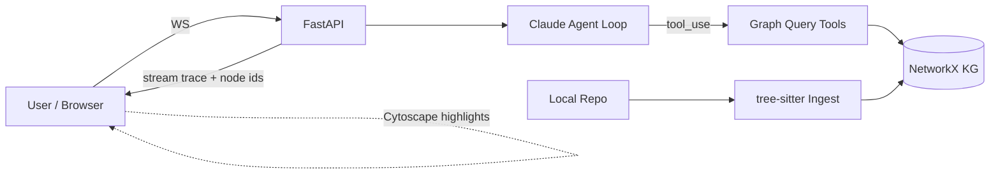

# CodeGraph Agent


> M7 demo + screenshots shipped. `record_demo.sh` boots backend + frontend, runs a scripted WebSocket question, captures `docs/screenshot.png` (via Playwright), and writes `docs/demo.gif`. Two sample repos live in `samples/`: `fastapi-slice` (Python) and `ts-utils` (TypeScript). Five example questions per sample are listed in the README.

---

## Problem statement

Vector-RAG treats code as prose and loses what actually matters: **structure**. A senior engineer asking *"what breaks if I change `handle_request`?"* needs call edges, inheritance chains, and import graphs — not cosine-similar docstrings.

CodeGraph Agent builds a **structural knowledge graph** of a repository's symbols and exposes that graph as tools to a Claude-powered agent. Instead of a fixed retrieval pipeline, the agent plans multi-hop traversals:

```
find_callers(handle_request)
  → neighborhood(each caller, depth=1)
  → rank by blast radius
```

The result is an answer that cites exact files and functions, with a live graph visualization showing which nodes the agent touched.

---

## What works — M7

| Area | Detail |
|---|---|
| Backend scaffold | FastAPI app (`src/codegraph/main.py`), managed with `uv` and `pyproject.toml` |
| Health endpoint | `GET /health` returns `{status, graph_loaded, nodes, edges}`; covered by tests |
| Frontend scaffold | Vite 6 + React 19 + TypeScript; `pnpm dev` starts the dev server on port 5173 |
| Linting / formatting | ruff-format + ruff lint on all backend Python; prettier on frontend TS/JSON/CSS |
| Pre-commit hooks | Both linters run on commit via `.pre-commit-config.yaml` |
| **Code ingestion** | `codegraph.ingest` walks a repo with `pathlib`, parses `.py` / `.ts` / `.js` files using `tree-sitter`, and emits typed `Symbol` dataclasses (`File`, `Class`, `Function`, `Method`) with file path and 1-indexed line spans |
| **Ingest CLI** | `python -m codegraph.ingest <path>` prints a JSON array of all symbols |
| **Knowledge graph** | `codegraph.graph.build_graph(symbols)` builds a `networkx.DiGraph` with typed nodes and 5 edge kinds: `CONTAINS`, `DEFINES`, `IMPORTS`, `CALLS`, `INHERITS` |
| **Graph persistence** | `save_graph(g, path)` / `load_graph(path)` round-trip via `nx.node_link_data` JSON (atomic write) |
| **KG-inspect CLI** | `python -m codegraph.graph <kg.json>` prints node/edge counts by type and samples 5 nodes + 5 edges |
| **Graph query tools** | 7 pure-Python functions in `codegraph/tools.py`: `find_definition`, `find_callers`, `find_callees`, `neighborhood`, `shortest_path`, `search_symbols`, `read_source` |
| **Claude agent loop** | `codegraph/agent.py` exposes `run_agent(question, graph, repo_root)` → sync generator yielding `tool_call`, `tool_result`, `text_delta` events |
| **`POST /ingest`** | Resolves a local path, runs ingestion + graph build, caches to `.kg_cache/`, updates `app.state` |
| **`GET /graph`** | Returns `{nodes, edges}` from the loaded graph for the Cytoscape UI |
| **`WebSocket /chat`** | Accepts `{"question": "..."}`, runs agent in a daemon thread, bridges events via `queue.Queue`, streams `tool_call` (each frame includes a `touched_nodes: list[str]` of graph node IDs visited by that tool) / `tool_result` / `text_delta` / `done` JSON frames |
| **Startup pre-index** | Server indexes `backend/sample_repo/` on boot (cached); demo works without any user action |
| **Sample repo** | `backend/sample_repo/` — a self-contained "web framework slice" (`depends.py`, `models.py`, `router.py`, `app.py`) that makes the canonical question *"What would break if I removed Depends?"* answerable |
| **React UI** | Two-pane layout: chat panel (left, 40 %) + Cytoscape graph panel (right). Nodes colour-coded by kind. `touched_nodes` events pulse nodes red for 2 s. Tool calls render as collapsible cards. |
| **`useChat` hook** | Manages WebSocket lifecycle + message accumulation via `useReducer`; dispatches `tool_call`, `tool_result`, `text_delta`, `done` frames |
| **GraphPanel** | Imperative Cytoscape.js via `useRef`; `cose` layout; node colours: File=indigo, Class=green, Function=orange, Method=yellow; `.highlighted` class (red border, 2 s) applied/removed on each `touchedNodes` change; in-panel kind legend rendered top-right |
| **Tests** | 51 pytest tests: 10 M2 + 10 M3 + 21 M4 tools + 1 health + 9 API tests (added `test_graph_node_link_format`) |
| **`record_demo.sh`** | Boots backend + frontend, runs scripted WebSocket question via `scripts/demo_query.py`, captures `docs/screenshot.png` (Playwright), writes `docs/demo.gif` |
| **`scripts/demo_query.py`** | Pure-Python WebSocket client; sends the canonical question and pretty-prints `tool_call` / `tool_result` / `text_delta` / `done` events |
| **`scripts/capture_screenshot.py`** | Playwright screenshot of the running UI; degrades gracefully if Playwright is not installed |
| **`scripts/smoke_test.sh`** | Hits `GET /health` and runs `demo_query.py`; exits 0/1 for CI |
| **`samples/fastapi-slice/`** | Self-contained Python sample repo; index via `POST /ingest` |
| **`samples/ts-utils/`** | Self-contained TypeScript sample repo; demonstrates IMPORTS + CALLS edges |
| License | MIT |

Set `ANTHROPIC_API_KEY` before connecting to `WebSocket /chat`. All HTTP routes work without it.

---

## Architecture



**Node types:** `File`, `Module`, `Class`, `Function`, `Method`

**Edge types:** `IMPORTS`, `DEFINES`, `CALLS`, `INHERITS`, `CONTAINS`

**Agent tools:** `find_definition`, `find_callers`, `find_callees`, `neighborhood`, `shortest_path`, `search_symbols`, `read_source`

---

## Quickstart

Full stack is functional. Set `ANTHROPIC_API_KEY` to enable the chat endpoint.

```bash
# Backend — auto-indexes sample_repo on startup
cd backend
uv sync
export ANTHROPIC_API_KEY=sk-ant-...   # only needed for /chat
uv run uvicorn codegraph.main:app --reload
# → http://localhost:8000/health
# → http://localhost:8000/graph     (after startup pre-index)
# → ws://localhost:8000/chat        (requires API key)

# Frontend (separate terminal)
cd frontend
pnpm install          # installs react, cytoscape, vite, typescript
pnpm dev
# → http://localhost:5173  (two-pane UI: chat + live graph)
```

```bash
# Run the end-to-end demo (boots both servers, runs a scripted question,
# captures docs/screenshot.png via Playwright, writes docs/demo.gif)
export ANTHROPIC_API_KEY=sk-ant-...
bash record_demo.sh
```

```bash
# Smoke test only (no browser required)
bash scripts/smoke_test.sh
```

```bash
# Run backend tests
cd backend
uv run pytest
```

```bash
# Ingest a repo and print symbols as JSON
cd backend
uv run python -m codegraph.ingest /path/to/any/repo
```

```bash
# Build a knowledge graph and save it, then inspect it
cd backend
uv run python -c "
from codegraph.graph import build_graph, save_graph
from codegraph.ingest import ingest_repo
symbols = ingest_repo('/path/to/any/repo')
g = build_graph(symbols, '/path/to/any/repo')
save_graph(g, 'kg.json')
"
uv run python -m codegraph.graph kg.json
```

Docker Compose is a stub — Dockerfiles are not yet written:

```bash
docker compose up  # not functional yet
```

---

## Repository layout

```
codegraph-agent/
├── backend/                   # Python / FastAPI
│   ├── pyproject.toml         # uv-managed; ruff + pytest configured
│   ├── src/codegraph/
│       ├── __init__.py
│       ├── main.py            # FastAPI app + /health, /ingest, /graph, /chat
│       ├── ingest/            # M2: tree-sitter ingestion
│       │   ├── __init__.py    # exports ingest_repo()
│       │   ├── __main__.py    # CLI: python -m codegraph.ingest <path>
│       │   ├── models.py      # Symbol dataclass
│       │   ├── parsers.py     # parse_python(), parse_typescript()
│       │   └── walker.py      # ingest_repo() directory walker
│       ├── graph/             # M3: knowledge graph
│       │   ├── __init__.py    # exports build_graph, save_graph, load_graph
│       │   ├── __main__.py    # CLI: python -m codegraph.graph <kg.json>
│       │   ├── builder.py     # build_graph() — nodes + 5 edge kinds
│       │   └── persistence.py # save_graph() / load_graph() JSON round-trip
│       ├── tools.py           # M4: 7 pure graph query functions (no Anthropic dep)
│       └── agent.py           # M4: Claude tool-use loop → run_agent() generator
│   ├── sample_repo/           # M5: bundled demo repo (depends/models/router/app)
│   └── tests/
│       ├── test_health.py
│       ├── test_ingest.py     # 10 tests for M2
│       ├── test_graph.py      # 10 tests for M3
│       ├── test_tools.py      # 21 tests for M4 graph tools
│       ├── test_api.py        # 8 tests for M5 API routes + WebSocket
│       └── fixtures/
│           └── sample_repo/   # sample.py + utils.ts + .hidden/
├── frontend/                  # Vite + React + TypeScript
│   ├── package.json           # cytoscape + @types/cytoscape added in M6
│   ├── vite.config.ts         # /api and /ws proxy with path rewrite
│   ├── tsconfig.json
│   └── src/
│       ├── index.css          # minimal reset
│       ├── main.tsx
│       ├── App.tsx            # root: fetches /api/graph, wires chat + graph panels
│       ├── types.ts           # GraphNode, GraphEdge, GraphData, ChatMessage
│       ├── hooks/
│       │   └── useChat.ts     # WebSocket lifecycle + useReducer message state
│       └── components/
│           ├── ChatPanel.tsx  # message list, input, auto-scroll
│           ├── GraphPanel.tsx # Cytoscape.js imperative init + highlight animation
│           └── ToolCallCard.tsx # collapsible card for agent tool calls
├── docs/
│   ├── demo.gif               # placeholder; populated by record_demo.sh
│   └── screenshot.png         # populated by scripts/capture_screenshot.py (Playwright)
├── samples/
│   ├── fastapi-slice/         # self-contained Python sample (app/router/models/depends)
│   └── ts-utils/              # self-contained TypeScript sample (src/ + package.json)
├── scripts/
│   ├── demo_query.py          # WebSocket client; runs the canonical question end-to-end
│   ├── capture_screenshot.py  # Playwright screenshot of the running UI
│   └── smoke_test.sh          # hits /health + demo_query.py; exits 0/1 for CI
├── record_demo.sh             # boots backend + frontend, runs demo, captures artifacts
├── docker-compose.yml         # stub
├── .pre-commit-config.yaml
├── .gitignore
└── README.md
```

---

## Why this is portfolio-strong

- **KG-as-tool** is a rare, senior-signal pattern — most people default to vector RAG
- Live graph animation makes results screenshot-able and GIF-able
- Every layer (parser → graph → tool → agent loop → streaming UI) is a distinct engineering artifact reviewers can inspect
- Runs locally on the Anthropic free tier

---

## Sample repositories & example questions

Two self-contained sample repos live in `samples/`. Index one at runtime:

```bash
curl -s -X POST http://localhost:8000/ingest \
  -H 'Content-Type: application/json' \
  -d '{"repo_path": "/absolute/path/to/samples/fastapi-slice"}'
```

### fastapi-slice (Python)

1. "What would break if I removed the `Depends()` helper?"
2. "Which route handlers call `get_db`?"
3. "What is the full call chain from `create_app` down to the database?"
4. "Find the definition of `require_auth` and show its source."
5. "What is the shortest dependency path between `list_users` and `get_db`?"

### ts-utils (TypeScript)

1. "Which functions does the `Formatter` class call internally?"
2. "What files import from `string-utils`?"
3. "Find the definition of `slugify` and show its source."
4. "What is the shortest path between `Formatter` and `string-utils`?"
5. "Show me all exported symbols in this package."

---

## License

MIT © 2026 Ritik
